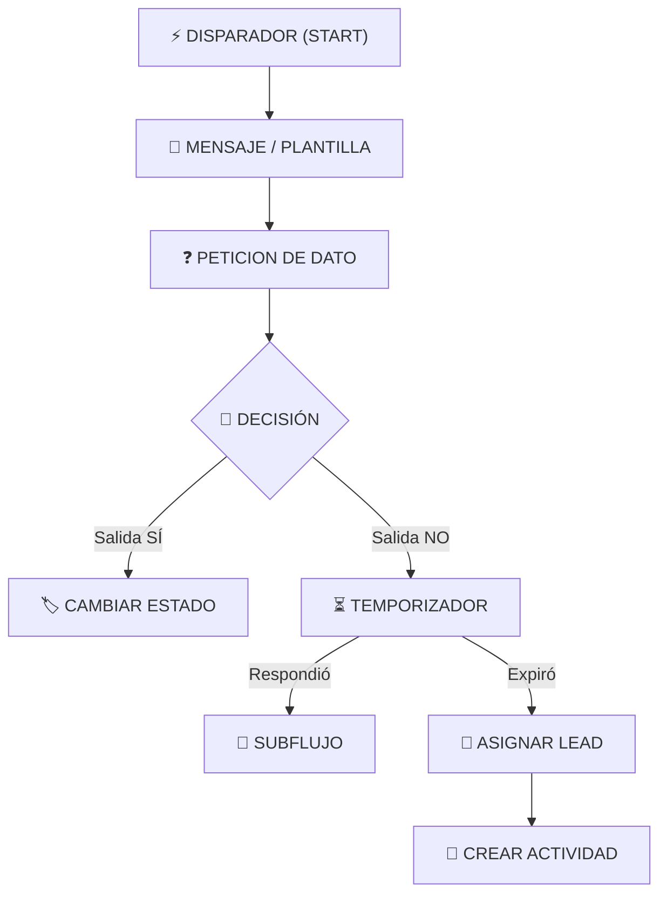
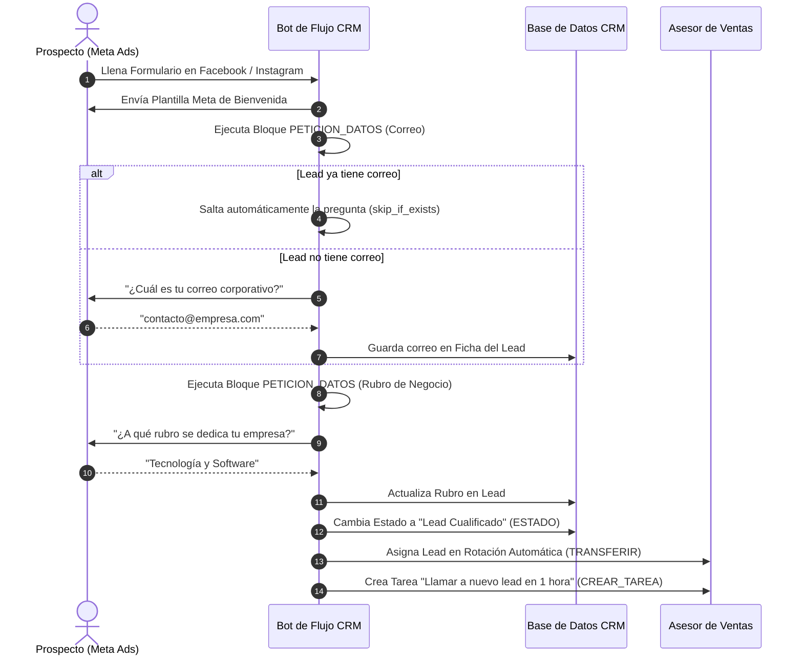
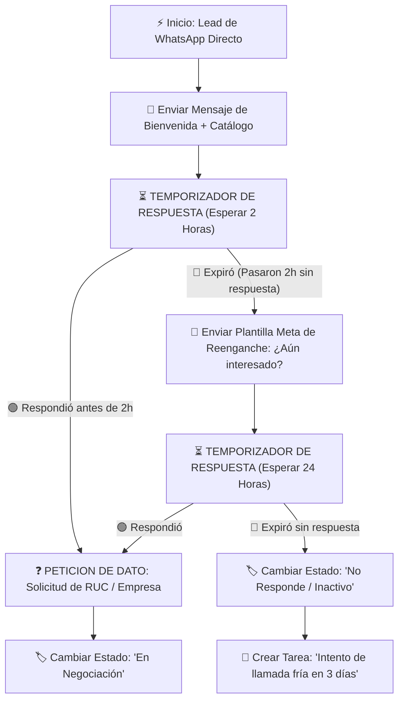

# 🚀 Guía Oficial: Diseñador de Flujos Autónomos y Automatización CRM

Bienvenido a la guía ejecutiva y técnica del **Diseñador Visual de Flujos Autónomos**. Esta herramienta permite crear secuencias inteligentes de conversación, cualificación de prospectos, asignación de asesores y seguimiento temporizado para WhatsApp, Facebook Messenger e Instagram DM.

---

## 💡 ¿Cómo Funciona la Petición de Datos y la Espera de Respuesta?

### ❓ Pregunta Clave: ¿`PETICION_DATOS` espera la respuesta en automático o debo agregar un bloque de `ESPERAR_RESPUESTA`?

> **Respuesta Directa**: El bloque **`PETICION_DATOS` incluye en automático la pausa y la espera de respuesta**. 

#### 🔄 Ciclo de Ejecución de `PETICION_DATOS`:
1. **Envío de Pregunta**: El bot envía la pregunta configurada (ej: *"¿Podrías indicarnos tu correo electrónico?"*).
2. **Pausa Automática**: El motor del CRM **detiene inmediatamente la ejecución** en ese punto y queda en estado de escucha.
3. **Recepción y Autoguardado**: Tan pronto el usuario responde por WhatsApp/Messenger, el bot toma la respuesta, la valida y **actualiza directamente el campo correspondiente en la ficha del Lead** (ej. campo `contact_email`).
4. **Avance Continuo**: Una vez guardado el dato, el flujo reanuda su marcha de forma automática hacia el siguiente bloque.

> **Consejo**:
> **No necesitas colocar un bloque de `ESPERAR_RESPUESTA` inmediatamente después de una `PETICION_DATOS`**.
> Si deseas controlar **qué sucede si el cliente NO responde después de un tiempo** (ej. pasadas 2 horas), simplemente conecta a continuación un nodo de **`TEMPORIZADOR`**.

---

## 🧩 Catálogo Exhaustivo de los 10 Bloques del Flujo



---

### 1. Disparador Inicial (`TRIGGER`)
- **Propósito**: Define las condiciones que deben cumplirse para iniciar automáticamente la ejecución del flujo sobre un Lead.
- **Modos de Disparo**:
  - **Por Canal u Origen**: Formularios de Meta (Lead Ads), Click to WhatsApp (CTWA), Facebook Messenger, Instagram Direct (DM), WhatsApp Directo/API, Formulario Web.
  - **Al Cambiar Estado de Gestión (Estatus CRM)**: Dispara el flujo en tiempo real en cuanto un Lead es movido a un estado de gestión específico (ej. *Recién Llegado*, *En Cotización*, *Interesado*).
  - **Filtros Granulares**: Formulario de Meta específico, Campaña Publicitaria, Grupo de Anuncios (AdSet) y Anuncio (Ad).
- **Ejemplo**: *"Iniciar flujo únicamente cuando un prospecto llena el Formulario de Meta Ads de la Campaña de Verano"*.

---

### 2. 💬 Enviar Mensaje / Plantilla (`MENSAJE`)
- **Propósito**: Envía un texto enriquecido o una Plantilla Oficial de Meta WhatsApp (HSM).
- **Características**: Soporta texto formateado (negritas, cursivas, listas), variables dinámicas (`{{contact_name}}`, `{{business_name}}`) y botones interactivos.
- **Ejemplo**: *"Hola {{contact_name}}, gracias por escribir a Atalaya CRM. ¿En qué solución estás interesado hoy?"*.

---

### 3. ❓ Petición de Datos Inteligente (`PETICION_DATOS`)
- **Propósito**: Solicita información clave al usuario para completar su perfil en el CRM.
- **Campos Disponibles**: Nombre Completo, Correo, Celular, Cargo, Empresa, RUC, Rubro/Sector, Subrubro, N° Trabajadores, Sitio Web, Notas.
- **Modo Inteligente (`skip_if_exists`)**:
  - Si el Lead ya cuenta con esa información registrada (ej. vino de Facebook Form con correo), **el bot salta la pregunta automáticamente** y no molesta al cliente.
- **Ejemplo**: *"¿Podrías facilitarnos tu correo electrónico para enviarte la cotización?"*.

---

### 4. 🔀 Toma de Decisión (`DECISION`)
- **Propósito**: Bifurca el camino en dos rutas (**🟢 SÍ / 🔴 NO**) según condiciones.
- **Criterios Prácticos de Evaluación**:
  1. 💬 **Palabra Clave en la Respuesta**: Verifica si el último mensaje del cliente contiene palabras como *"cotización"*, *"precio"*, *"catálogo"*, *"humano"*, etc.
  2. ❓ **Verificación de Datos Faltantes**: Evalúa si al Lead le falta un campo clave (ej. ¿Falta registrar Correo? ¿Falta Empresa?) para decidir si derivarlo a un bloque de `PETICION_DATOS` o continuar la venta.
  3. 🌐 **Origen / Red Social**: Identifica si el prospecto proviene de *Facebook Lead Ads*, *Instagram DM*, *WhatsApp Directo*, etc.
  4. 🕒 **Horario Laboral de Atención**: Comprueba si el mensaje llegó en horario de oficina.
  5. 🔥 **Temperatura del Chat**: Evalúa la clasificación actual del Lead (*Caliente*, *Tibio*, *Frío*).
- **Ejemplo**: *"Si el mensaje del cliente contiene 'cotizar' ➔ Salida SÍ (Enviar catálogo de precios). Si no ➔ Salida NO (Enviar menú general)"*.

---

### 🎨 Arrastrar y Soltar Bloques al Lienzo (Drag & Drop)

El diseñador permite dos formas de agregar bloques al diagrama:
1. **Hacer Clic**: Añade el bloque automáticamente en la zona central disponible.
2. **Arrastrar con el Mouse (Drag & Drop)**: Puedes tomar cualquier botón de la barra izquierda de bloques con el mouse, arrastrarlo sobre el lienzo y soltarlo exactamente en las coordenadas X,Y donde desees ubicarlo.

---

### 5. 🏷️ Cambiar Estado / Temperatura (`ESTADO`)
- **Propósito**: Actualiza la clasificación del prospecto en el CRM sin intervención humana.
- **Campos**:
  - **Estado de Gestión (Obligatorio)**: Ej. *"En Prospectación"*, *"Cotizado"*, *"No Responde"*.
  - **Temperatura (Opcional)**: 🔥 Caliente, ⚡ Tibio, ❄️ Frío (o sin cambio).
- **Ejemplo**: *"Marcar estado como 'Interesado Caliente' tras responder el formulario"*.

---

### 6. 👤 Asignar / Transferir Lead (`TRANSFERIR`)
- **Propósito**: Asigna la propiedad del Lead y transfiere la conversación a un usuario o equipo.
- **Modos**:
  - Asesor Específico (ej. *"Juan Pérez"*).
  - Rotación Automática (Round-Robin equilibrado entre asesores activos).
- **Ejemplo**: *"Asignar el lead en rotación al equipo comercial para atención telefónica"*.

---

### 7. ⏸️ Esperar Respuesta (`ESPERAR_RESPUESTA`)
- **Propósito**: Pausa el flujo de mensajes salientes continuos hasta que el cliente envíe su próximo mensaje.
- **Uso**: Ideal cuando envías un menú de opciones o información general y deseas detener el bot hasta que el cliente escriba algo.
- **Ejemplo**: *"Pausar flujo tras enviar la carta de presentación hasta que el cliente responda"*.

---

### 8. ⏳ Temporizador de Respuesta (`TEMPORIZADOR`)
- **Propósito**: Controla límites de tiempo de inactividad con bifurcación dual.
- **Salidas**:
  - **🟢 Respondió**: El usuario escribió antes de cumplirse el plazo.
  - **🔴 Expiró (Sin Resp.)**: Transcurrió el tiempo configurado (minutos, horas o días) sin recibir respuesta.
- **Ejemplo**: *"Esperar 4 horas tras la plantilla. Si no responde ➔ Enviar plantilla de reenganche"*.

---

### 9. 🔄 Conectar con otro Flujo (`SUBFLUJO`)
- **Propósito**: Permite encadenar flujos modulares para reutilizar secuencias completas.
- **Ejemplo**: *"Derivar la conversación hacia el 'Subflujo de Agendamiento de Demos'"*.

---

### 10. Programar Proceso / Actividad (`CREAR_TAREA`)
- **Propósito**: Asigna un **Proceso real del CRM** (registrado en el módulo *Procesos*) y programa una actividad/tarea asociada al Lead.
- **Campos de Configuración**:
  - **Proceso del CRM**: Selector con buscador (`SearchableSelect`) que lista todos los procesos reales creados en la tabla `processes` (`Process::where('business_id', ...)`).
  - **Título de la Actividad**: Descripción de la tarea (ej. *Seguimiento de Cotización*, *Llamada 24h*).
  - **Tipo de Actividad / Nota**: Selector que lista las categorías reales del CRM (`note_types`).
  - **Plazo de Vencimiento**: Inmediato (0h), 1h, 4h, 24h, 48h o 1 semana.
  - **Asignado a**: Asesor asignado al Lead o usuario comercial específico.
- **Ejemplo**: *"Programar llamada de seguimiento en 24 horas asignada al asesor del Lead"*.

---

## 📐 Ejemplos Prácticos de Flujos para Clientes

### Ejemplo 1: Captura & Cualificación de Leads desde Meta Ads (Facebook/Instagram)



---

### Ejemplo 2: Recordatorio Temporizado y Reenganche de Clientes Inactivos



---

---

## ❓ Preguntas Frecuentes para Presentación a Clientes

#### 1. ¿Qué pasa si el cliente envía varios mensajes seguidos?
El bot los procesa en secuencia sin perder el hilo y actualiza los campos correspondientes.

#### 2. ¿El bot puede trabajar fuera del horario laboral?
Sí. El sistema funciona 24/7 y puede dejar programadas tareas (`CREAR_TAREA`) para la primera hora del siguiente día hábil.

#### 3. ¿Se pueden reutilizar flujos entre campañas?
Sí. Con el bloque **`SUBFLUJO`**, puedes crear módulos estandarizados (ej. *Subflujo de Preguntas Frecuentes* o *Subflujo de Cobranzas*) y llamarlos desde cualquier flujo principal.

---

## ⚙️ Configuración, Estado de Flujos y Ejecución en Segundo Plano (Workers)

### 🔴 Estado Inactivo por Defecto al Crear Flujos (`status: false`)
Para evitar que un flujo se active prematuramente en producción mientras aún está en proceso de diseño o pruebas:
- **Todo flujo recién creado inicia desactivado por defecto (`status = 0 / false`)**.
- Los disparadores y webhooks ignoran automáticamente los flujos inactivos.
- Una vez verificado el diagrama, el administrador debe activar el flujo mediante el switch de activación (toggle ON) en la lista de flujos.

---

### 🖥️ Ejecución en Segundo Plano (Laravel Queues & Background Workers)

Para procesar la secuencia de nodos, las esperas temporizadas y el reenganche de clientes sin congelar el servidor ni la interfaz del CRM, el sistema utiliza **Colas Asíncronas (Laravel Queues)**.

#### 1. Ejecución Manual en Entorno Local / Desarrollo
```bash
php artisan queue:work --queue=flows,default --tries=3 --timeout=90
```

#### 2. Configuración en Servidor de Producción (Linux / Supervisor)
En producción, se utiliza **Supervisor** para mantener la cola de flujos ejecutándose de forma permanente en segundo plano. Si el servidor se reinicia o ocurre un error, Supervisor reinicia el proceso automáticamente.

Archivo de configuración recomendada (`/etc/supervisor/conf.d/atalaya-crm-worker.conf`):

```ini
[program:atalaya-crm-worker]
process_name=%(program_name)s_%(process_num)02d
command=php /var/www/crm/artisan queue:work --queue=flows,default --sleep=3 --tries=3 --max-time=3600
autostart=true
autorestart=true
stopasgroup=true
killasgroup=true
user=www-data
numprocs=2
redirect_stderr=true
stdout_logfile=/var/www/crm/storage/logs/worker.log
```

Comandos para activar Supervisor en el servidor:
```bash
sudo supervisorctl reread
sudo supervisorctl update
sudo supervisorctl start atalaya-crm-worker:*
```

#### 3. Optimización de Recursos y Control de Carga
- **Dormido Eficiente (`--sleep=3`)**: Cuando no hay mensajes ni eventos pendientes, el worker entra en reposo de 3 segundos, consumiendo prácticamente **0% de CPU**.
- **Consumo de Memoria Controlado (`--max-time=3600`)**: Reinicia suavemente el proceso worker cada hora para liberar memoria RAM acumulada.
- **Resiliencia ante Fallos (`--tries=3`)**: Si una conexión a la API de WhatsApp o Meta falla por problemas de red, el sistema reintenta la entrega hasta 3 veces automáticamente.

---

## 📊 Estimación de Capacidad & Rendimiento (Capacity Planning VPS 6GB RAM / 4 vCPUs)

### ❓ Pregunta de Infraestructura: Con 50-100 clientes activos y picos de 1,000 leads simultáneos, ¿el servidor aguanta o se cae?

> **Dictamen Técnico de Ingeniería**: **SÍ AGUANTA PERFECTAMENTE Y NO SE CAERÁ**, siempre y cuando se utilice **Redis como motor de colas (`QUEUE_CONNECTION=redis`)**.

#### 1. Distribución de Memoria RAM en el VPS (6 GB Total):
| Servicio / Proceso | Asignación RAM | Estado / Uso |
| :--- | :--- | :--- |
| **MySQL / MariaDB (`innodb_buffer_pool_size`)** | 1.50 GB | Gestión de base de datos e índices |
| **PHP-FPM (Nginx / Apache)** | 1.50 GB | ~20 procesos FPM para peticiones web |
| **Redis Server (Queue Broker)** | 0.25 GB | Almacenamiento ultrarrápido en RAM de colas |
| **Supervisor Workers (2 a 4 Procesos)** | 0.16 GB | Procesa ~50-80 nodos de flujo por segundo |
| **Sistema Operativo & Buffers Kernel** | 1.50 GB | Rendimiento de OS Linux |
| **Margen de Seguridad Libre** | **~1.09 GB Libre** | **Garantía anti-cuelgues por picos** |

---

#### 2. ¿Por qué NO se cae el servidor ante un pico de 1,000 Leads simultáneos?

1. **Desacoplamiento con Colas (Regulador Asíncrono / Throttling)**:
   - Cuando llegan 1,000 leads juntos (ej. por disparo de campaña o webhook de Meta Ads), el CRM **NO procesa los 1,000 flujos al mismo milisegundo en la petición HTTP**.
   - El sistema inserta los 1,000 trabajos ligeros en **Redis** en solo **0.15 segundos** (consumiendo menos de 1% CPU).
   - Los **Workers de Supervisor** consumen la cola a un ritmo regulado de **30 a 50 mensajes por segundo**, procesando la ráfaga de 1,000 leads en **20 a 30 segundos** sin colapsar.

2. **Protección de Consumo de Recursos**:
   - La RAM y la CPU se mantienen en niveles normales (máx 35-45% CPU durante el pico) porque el trabajo se ejecuta en segundo plano en lotes (*batch processing*), sin saturar las conexiones de MySQL.

3. **Configuración Recomendada en `.env`**:
   - Configurar: `QUEUE_CONNECTION=redis` (Evitar el driver `database` para alta concurrencia).
   - Ajustar `numprocs=2` a `numprocs=3` en el archivo de Supervisor.

---

## 🧪 Simulador de Flujos en Vivo (Entorno de Pruebas Interactivo)

Para evitar que los administradores o clientes trabajen "a ciegas", el diseñador cuenta con un **Simulador Interactivo en Tiempo Real**:

### 📱 Características del Simulador:
1. **Botón en Barra de Herramientas**: `Simular / Probar Flujo`.
2. **Visualización de Celular / Chat**: Muestra la pantalla del teléfono con los mensajes de prueba enviados por el bot y las acciones realizadas en el CRM (cambios de estado, asignaciones de asesores y tareas).
3. **Interacción del Cliente de Prueba**: Permite al diseñador escribir cualquier respuesta (ej. *"quiero cotizar"*) para evaluar el comportamiento de los nodos de **`DECISION`** (salidas SÍ / NO) y **`PETICION_DATOS`**.
4. **Bitácora de Nodos en Tiempo Real**: Muestra el registro paso a paso de cada nodo ejecutado con timestamps.

---
*Documento generado por Atalaya CRM - Diseñador de Flujos Autónomos v2.0*
